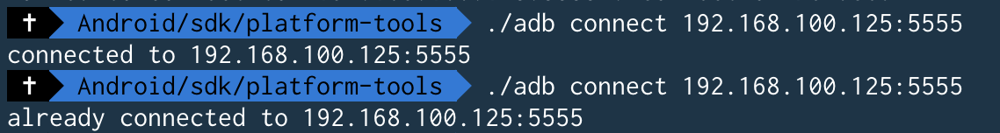

# HearBeatReader

- The idea is to be able to sense the hearbeat of the public speaker while this is speaking.. so we can have a measure
of how well the emotions are being handled during the speech or be able to spot improvement as the speech is being practiced over and over


## Start debugging over wifi using adb
1. Configure the Debugging Over wifi using this [guide](https://developer.android.com/training/wearables/apps/debugging)
1. Go to Library/Android/sdk/platform-tools (MacOs)
1. Execute ``` ./adb connect 192.168.100.125:5555```

1. Then you can start the debugger and automatically the app is going to be installed
1. Test the app!

'Add pictures or gif showing the app'

## Logcat from Android studio when debugging
```
2020-06-29 22:03:44.181 3713-3713/? I/heartbeatreade: Late-enabling -Xcheck:jni
2020-06-29 22:03:47.905 3713-3713/com.example.heartbeatreader D/OpenGLRenderer: Skia GL Pipeline
2020-06-29 22:04:22.901 3713-3746/com.example.heartbeatreader I/Adreno: QUALCOMM build                   : 5e278f2, Ie1542401b9
    Build Date                       : 08/13/18
    OpenGL ES Shader Compiler Version: EV031.25.00.00
    Local Branch                     : gfx-adreno.lnx.1.0
    Remote Branch                    :
    Remote Branch                    :
    Reconstruct Branch               :
2020-06-29 22:04:22.901 3713-3746/com.example.heartbeatreader I/Adreno: Build Config                     : S L 6.0.2 AArch32
2020-06-29 22:04:23.042 3713-3746/com.example.heartbeatreader I/Adreno: PFP: 0x003ff016, ME: 0x003ff041
2020-06-29 22:04:23.105 3713-3746/com.example.heartbeatreader I/ConfigStore: android::hardware::configstore::V1_0::ISurfaceFlingerConfigs::hasWideColorDisplay retrieved: 0
2020-06-29 22:04:23.106 3713-3746/com.example.heartbeatreader I/ConfigStore: android::hardware::configstore::V1_0::ISurfaceFlingerConfigs::hasHDRDisplay retrieved: 0
2020-06-29 22:04:23.107 3713-3746/com.example.heartbeatreader I/OpenGLRenderer: Initialized EGL, version 1.4
2020-06-29 22:04:23.107 3713-3746/com.example.heartbeatreader D/OpenGLRenderer: Swap behavior 2
2020-06-29 22:04:25.619 3713-3713/com.example.heartbeatreader D/MainActivity:  Sensor registered: yes
2020-06-29 22:04:33.034 3713-3713/com.example.heartbeatreader D/MainActivity: onAccuracyChanged - accuracy: 2
2020-06-29 22:04:37.872 3713-3713/com.example.heartbeatreader D/MainActivity: onAccuracyChanged - accuracy: 3
2020-06-29 22:04:39.820 3713-3713/com.example.heartbeatreader D/MainActivity:  Sensor stopped
2020-06-29 22:04:41.408 3713-3713/com.example.heartbeatreader D/MainActivity:  Sensor registered: yes
2020-06-29 22:05:08.133 3713-3713/com.example.heartbeatreader D/MainActivity: onAccuracyChanged - accuracy: 2
2020-06-29 22:05:11.985 3713-3713/com.example.heartbeatreader D/MainActivity: onAccuracyChanged - accuracy: 3
2020-06-29 22:05:13.921 3713-3713/com.example.heartbeatreader D/MainActivity: onAccuracyChanged - accuracy: 2
2020-06-29 22:05:28.436 3713-3713/com.example.heartbeatreader D/MainActivity: onAccuracyChanged - accuracy: 3
2020-06-29 22:05:31.383 3713-3713/com.example.heartbeatreader D/MainActivity: onAccuracyChanged - accuracy: 2
2020-06-29 22:05:35.474 3713-3713/com.example.heartbeatreader D/MainActivity: onAccuracyChanged - accuracy: 3
2020-06-29 22:05:37.143 3713-3713/com.example.heartbeatreader D/MainActivity: onAccuracyChanged - accuracy: 2
2020-06-29 22:05:38.114 3713-3713/com.example.heartbeatreader D/MainActivity: onAccuracyChanged - accuracy: 1
2020-06-29 22:05:41.193 3713-3713/com.example.heartbeatreader D/MainActivity:  Sensor stopped
2020-06-29 22:06:34.331 3713-3713/com.example.heartbeatreader D/MainActivity:  Sensor registered: yes
```

References:
https://github.com/alejandrocq/HeartRateTest/blob/master/wear/src/main/java/com/alejandro_castilla/heartratetest/MainActivity.java

